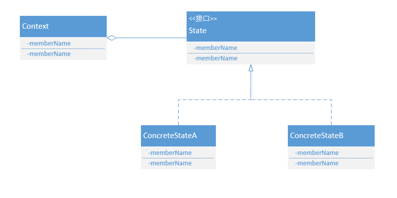

#状态模式

##前言

想必大家在平时开发的过程中肯定会遇到一个方法中需要根据对象不同的状态来执行不同的操作。对于这种情况，有一种实现方式是用对象实例变量来表示当前状态，然后通过if...else...或者switch...case...对状态进行判断，然后执行对应的操作。可以通过下面的例子表示这种方式：

通过枚举值来表示状态

```java
enum TCPState {
    ESTABLISHED, LISTEN, CLOSED,
}
```

使用一个变量来代表当前状态，并提供修改状态的方法：

```java
private TCPState tcpState;

public TcpConnection(TCPState tcpState) {
    super();
    this.tcpState = tcpState;
}
```

在处理方法中，对当前状态进行判断，执行状态对应的操作并修改对象的状态值

```java
public void handle() {

    /**
     * 使用if...else...或者switch...case...
     */
    if (tcpState == TCPState.ESTABLISHED) {
        System.out.println("连接已建立，启动监听");
        tcpState = TCPState.LISTEN;
    } else if (tcpState == TCPState.LISTEN) {
        System.out.println("监听，关闭连接");
        tcpState = TCPState.CLOSED;
    } else if (tcpState == TCPState.CLOSED) {
        System.out.println("连接关闭，建立连接");
        tcpState = TCPState.ESTABLISHED;
    }
}
```

客户端调用时，设定初始的状态值，然后调用handle方法

```java
/**
 * @author: 作者： xuefei
 * @date: 创建时间：2019-07-21 16:18:03
 * @Description: TODO
 * @version V1.0
 */
public class TCPClient {

    public static void main(String[] args) {
        TcpConnection connection = new TcpConnection(TCPState.ESTABLISHED);
        connection.handle();
        connection.handle();
        connection.handle();
    }

}

输出如下：
连接已建立，启动监听
监听，关闭连接
连接关闭，建立连接
```

最后输出为：

	连接已建立，启动监听
	监听，关闭连接
	连接关闭，建立连接
	
这样做的确能解决问题，但是代码的可扩展性、可维护性、可读性都不好，主要的缺点有以下几个：

1. 上面的例子中状态只有三个，如果状态的情况比较多的情况，代码中就会出现大段的if...else...判断代码，这样代码的可读性就降低了。
2. 对于上面的实现，如果想新增一种状态，需要修改代码新增if判断，这样违背了开闭原则，可扩展性不是很好。

而本文所将的状态模式就是为了解决上述场景所带来的问题。


##状态模式的意图
允许对象在其内部改变状态的时候修改其行为。

##状态模式的适用性
下面的两种情况下均可使用State模式

+ 一个对象的行为取决于它的状态，并且它必须在运行时候根据状态改变其行为
+ 一个操作中含有庞大的分支条件语句，且分支依赖于该**对象本身的状态**。State将每一个条件分支放入独立的类中，这使得你可以根据对象自身的情况将对象的状态作为一个对象，这个对象可以不依赖于其他对象而独立变化。

##状态模式的结构


##状态模式的参与者
+ Context（环境，如TCPConnection）：定义客户端需要调用的接口，并维护一个ConcreteState子类的实例，这个实例定义当前的状态
+ State（状态，如TCPState）：定义一个接口以封装与Context一个特定状态相关的行为
+ ConcreteState（具体状态子类，如TCPEstablished、TCPListen、TCPClosed）：每一个子类实现一个与Context的一个状态相关的行为

##状态模式参与者之间的协作
+ Context将与状态相关的请求委托给当前的ConcreteState对象处理
+ Context将自身的状态作为参数传递给处理该请求的状态对象，这使得该对象在必要时可以访问Context
+ Context是客户使用的主要接口。客户可用Context来配置一个Context，一旦一个Context配置完毕，它的客户不再需要直接与状态对象打交道
+ Context或ConcreteState对象都可决定对象的顺序以及对象的转换条件

## 使用状态模式的效果
1. 它将特定状态相关的行为局部化，并且将不同状态的行为分隔开来
2. 它使得状态的转换显式化
3. State对象可以被共享。如果State对象没有实例变量，是无内部状态的（即它们表示的状态完全以它们的类型来编码），那么Context对象可以共享一个State对象。

##实现

状态模式实现时通常要考虑状态的转换由谁来定义、状态何时创建、何时销毁等问题。

###谁定义状态的转换

对于谁定义状态的转换，通常有两种选择，一种是由Context来完全控制，另一种是由具体的状态实现类来进行状态转换。其实，无论哪种方式，最终结果都需要让Context知道当前的状态是什么。

如果由Context来完全控制状态的变更，那它就需要知道所有的状态以及每个状态的后续状态是什么，在这种情况下，新增状态以及修改状态的变更情况都需要修改Context的逻辑，扩展性不如用具体的状态实现类来进行状态转换。

如果让具体的状态实现类来进行状态转换，就需要在Context中增加一个接口，让具体的状态类显式地设定Context的当前状态。这种方式的优点是可以很容易地定义新的State子类来修改和扩展，缺点是一个State至少拥有一个其他子类的信息，这样各个子类之前就产生了依赖。

### 何时创建、销毁对象状态
何时创建、销毁对象状态一般有两种考虑

1. 在需要使用时创建使用后进行销毁。
2. 提前创建它们而且始终不销毁。

当将要进入的状态是运行时不可知的，并且上下文不经常改变状态时，第一种选择较为合适。这种方法避免创建不会被用到的对象，这一点在State对象存储大量信息时尤为重要。当状态改变很频繁时，第二种方法较好。在这种情况下最好避免销毁状态，因为可能很快再次需要用到它们，此时可以预先一次付清创建各个状态对象的开销，并且在运行过程中根本不存在销毁对象时的开销。但是这种方式Context必须保存对所有可能会进入的状态的引用。

## 代码实现

定义State接口,接口Context，以便在必要时执行Context方法，主要是修改当前状态

```java
/**
 * @author: 作者： xuefei
 * @date: 创建时间：2019-07-22 00:13:01
 * @Description: TODO
 * @version V1.0
 */
public interface State {

    void handle(TCPConnection tcpConnetction);

}
```

定义Context，将客户端的请求委托给具体状态，并将自身作为参数传递给具体状态类

```java
/**
 * @author: 作者： xuefei
 * @date: 创建时间：2019-07-22 00:16:14
 * @Description: TODO
 * @version V1.0
 */
public class TCPConnetction {

    private State state;

    public State getState() {
        return state;
    }

    public void setState(State state) {
        this.state = state;
    }

    void handle() {
        state.handle(this);
    }

}
```

定义具体的状态类,处理具体逻辑，并调用Context方法设定状态

```java
/**
 * @author: 作者： xuefei
 * @date: 创建时间：2019-07-22 00:22:06
 * @Description: TODO
 * @version V1.0
 */
public class ClosedState implements State {

    @Override
    public void handle(TCPConnection tcpConnection) {
        System.out.println("连接已断开，建立连接");
        EstablishedState establishedState = new EstablishedState();
        tcpConnection.setState(establishedState);
    }
}
```

```java
/**
 * @author: 作者： xuefei
 * @date: 创建时间：2019-07-22 00:14:08
 * @Description: TODO
 * @version V1.0
 */
public class EstablishedState implements State {

    @Override
    public void handle(TCPConnection tcpConnection) {
        System.out.println("连接已建立，启动监听");
        ListenState listenState = new ListenState();
        tcpConnection.setState(listenState);
    }

}
```

```java
/**
 * @author: 作者： xuefei
 * @date: 创建时间：2019-07-22 00:21:17
 * @Description: TODO
 * @version V1.0
 */
public class ListenState implements State {

    @Override
    public void handle(TCPConnection tcpConnection) {
        System.out.println("监听，关闭连接");
        ClosedState closedState = new ClosedState();
        tcpConnection.setState(closedState);
    }
}
```

客户端调用

```java
TCPConnection connetction = new TCPConnection();
ClosedState closedState = new ClosedState();
connetction.setState(closedState);

connetction.handle();
connetction.handle();
connetction.handle();
```

最终输出

	连接已断开，建立连接
	连接已建立，启动监听
	监听，关闭连接

在上述代码中，具体的状态类都是没有内部状态的，因此可以采用单例模式创建对象，而不是每次都创建一个新对象。另外，Context也不一定只有一个handle方法，这个要看具体的情况来定，主要思想还是要将客户端的请求转发给具体的类对象。


